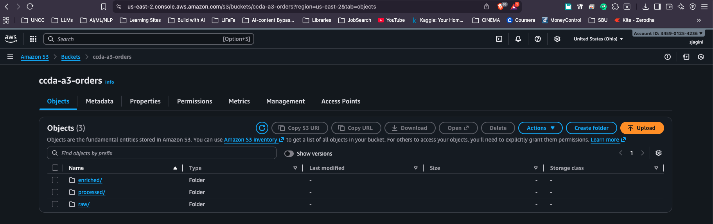
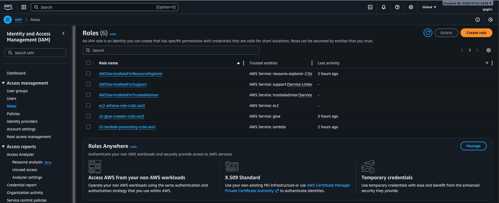
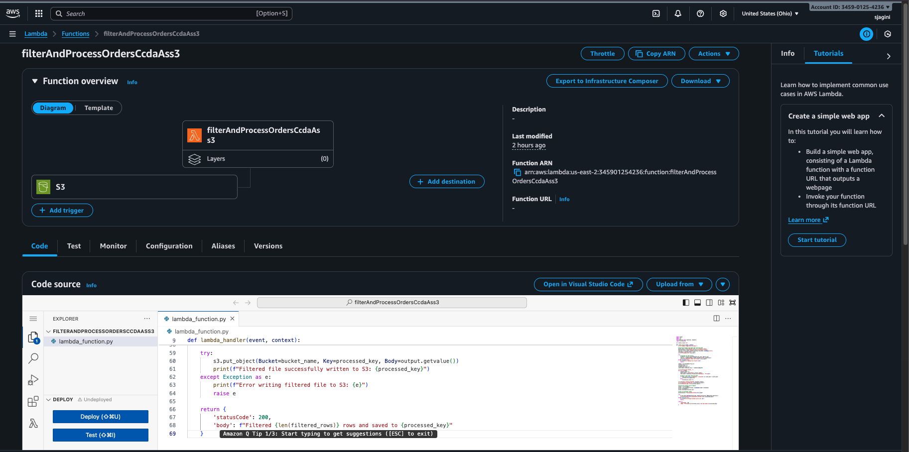
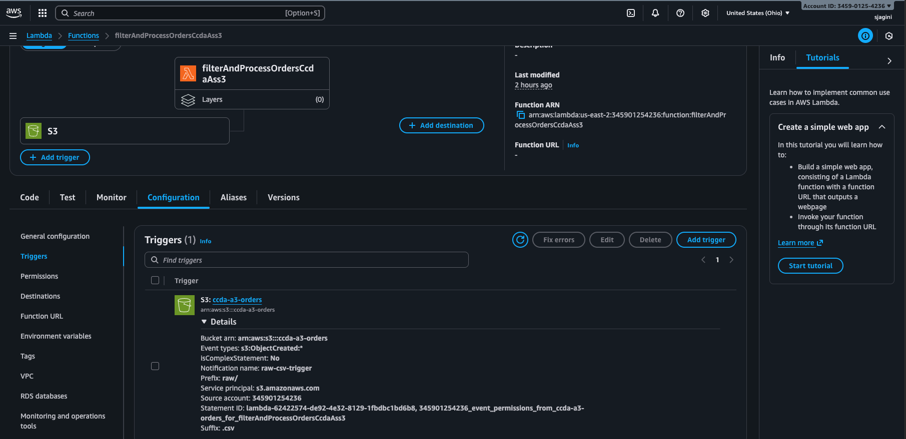
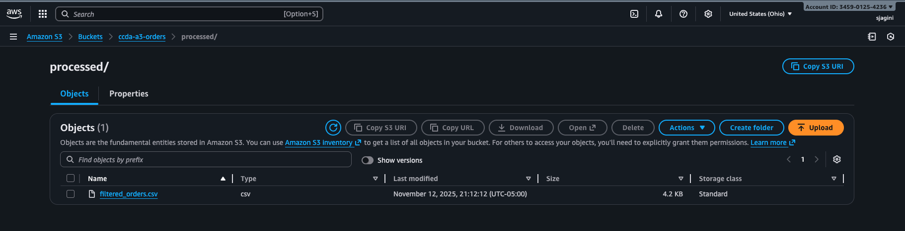
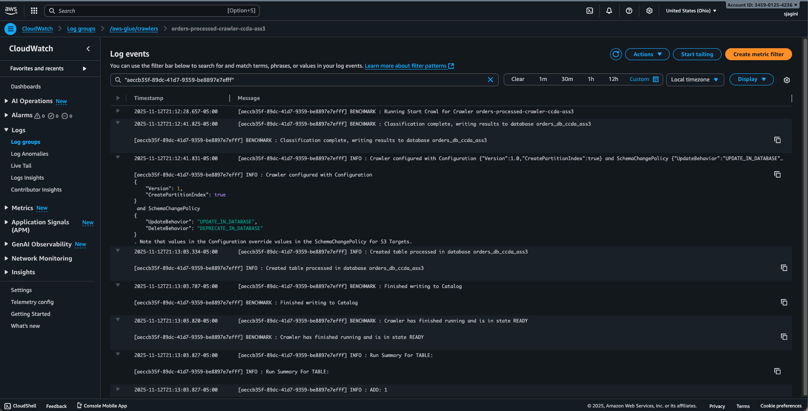
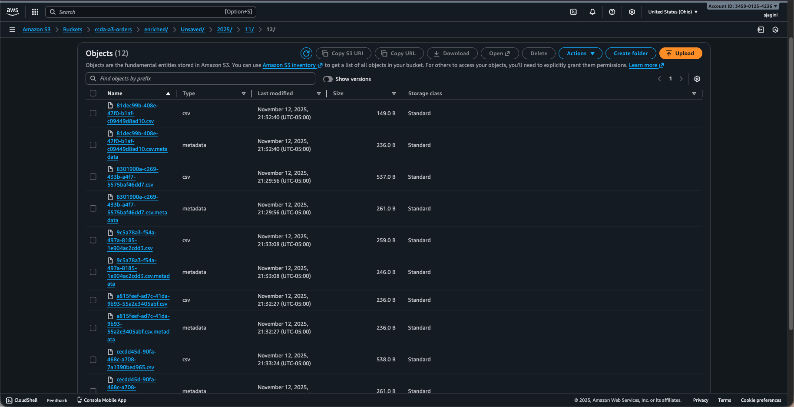
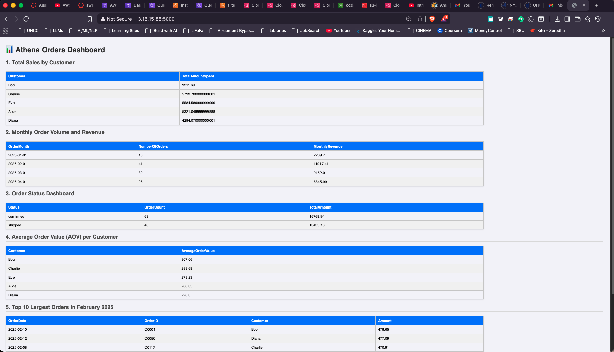

# ITCS-6190 Assignment 3 – AWS Native Data Pipeline

**Student:** SaiKiran (801484665)  
**Course:** ITCS-6190 Cloud Computing for Data Analysis  
**Date:** 11 Nov 2025

---

**Workflow Overview**
1. Organize storage in Amazon S3 for raw, processed, and enriched data tiers.
2. Create IAM roles so Lambda, Glue, and EC2 can talk to S3/Athena securely.
3. Author a Python Lambda function that cleans the uploaded CSV.
4. Attach an S3 trigger so every new file is processed immediately.
5. Confirm the processed object lands in the correct prefix.
6. Run a Glue crawler and inspect CloudWatch logs for schema discovery.
7. Use Athena to query the curated dataset and keep results in S3.
8. Expose the query outputs on an EC2-hosted dashboard.

---

## 1. Amazon S3 Data Zones
- Bucket: assignment bucket (N. Virginia)
- Prefixes:
  - `raw/` for incoming uploads such as `Orders.csv`.
  - `processed/` for Lambda outputs named `filtered_<file>.csv`.
  - `enriched/` for Athena result sets consumed by the dashboard.
- Rationale: Separating each lifecycle stage simplifies IAM scoping, keeps ingestion immutable, and provides a clear audit trail when troubleshooting.



---

## 2. IAM Roles That Glue The Services Together
| Role | Purpose | Key Policies |
| --- | --- | --- |
| `Lambda-S3-Processing-Role` | Lets Lambda read raw objects, write processed files, and publish logs. | `AWSLambdaBasicExecutionRole`, `AmazonS3FullAccess` |
| `Glue-S3-Crawler-Role` | Allows the crawler to inspect processed objects and update the catalog. | `AmazonS3FullAccess`, `AWSGlueConsoleFullAccess`, `AWSGlueServiceRole` |
| `EC2-Athena-Dashboard-Role` | Empowers the EC2 instance to submit Athena queries and fetch their outputs. | `AmazonS3FullAccess`, `AmazonAthenaFullAccess` |

Each role follows least-privilege principles so secrets never get embedded in code.



---

## 3. Lambda Function – `FilterAndProcessOrders`
- Runtime: Python 3.9
- Handler logic:
  1. Load the uploaded CSV from `raw/` using boto3.
  2. Drop orders that are either `pending` or `cancelled` **and** older than 30 days.
  3. Preserve the rest (recent activity plus all committed shipments).
  4. Save the cleaned data to `processed/filtered_<filename>.csv`.
  5. Log total vs. retained counts for traceability.
- Execution role: `Lambda-S3-Processing-Role`
- Timeout raised to 60 seconds so larger CSVs finish without retries.



---

## 4. Event-Driven Processing With S3 Triggers
- Source bucket: assignment bucket
- Event type: `ObjectCreated`
- Filters: prefix `raw/`, suffix `.csv`
- Outcome: Uploading `Orders.csv` immediately invokes the Lambda, eliminating manual runs or cron jobs.



---

## 5. Verifying The Processed Output
Once the trigger fires, the Lambda writes `processed/filtered_Orders.csv`. This checkpoint proves the wiring works end-to-end and that the pipeline is ready for Glue.



---

## 6. Glue Crawler & CloudWatch Evidence
- Crawler name: `orders_processed_crawler`
- Data store: `s3://<assignment-bucket>/processed/`
- Destination database: `orders_db`
- IAM role: `Glue-S3-Crawler-Role`
- Validation: Checked CloudWatch logs to verify that the crawler completed successfully and registered the `processed` table with the detected schema.



---

## 7. Athena Queries And Enriched Folder
Using the AWS Glue catalog, I issued the following Athena queries (Trino engine) against `orders_db.processed`:
- Customer-level revenue totals
- Monthly order volume and revenue aggregation
- Order status distribution (confirmed vs. shipped vs. other)
- Average order value per customer
- Top 10 highest order amounts in Feb 2025

Query results write to `s3://<assignment-bucket>/enriched/`, keeping historical outputs that the dashboard can reuse without rerunning every query.



---

## 8. EC2-Hosted Dashboard
- Instance: Amazon Linux 2023 `t2.micro` with a security group that allows SSH from my IP and TCP 5000 for the web UI.
- IAM instance profile: `EC2-Athena-Dashboard-Role` (grants Athena/S3 access).
- Application stack: Flask + boto3 (`EC2InstanceNANOapp..py`).
- Behavior: On page load, the app fires the same five Athena queries, waits for completion, retrieves the CSV outputs, and renders them as HTML tables labeled on the dashboard.



---

## Lessons Learned & Cleanup Tips
- Event-driven architectures drastically cut manual intervention; Lambda + S3 triggers handled every upload automatically.
- IAM roles removed the need for static credentials while still enabling service-to-service calls.
- Monitoring (CloudWatch logs for Lambda/Glue) shortened debug cycles when validating the pipeline.
- Everything stayed inside the AWS Free Tier thanks to tiny datasets and short runtimes.
- After grading, stop or terminate the EC2 instance, empty/delete the S3 bucket, remove the Lambda function, delete the Glue crawler/database, and detach IAM roles to avoid lingering costs.

---

## Repository Map
```
.
├── EC2InstanceNANOapp..py  # Flask application executed on the EC2 host
├── LambdaFunction.py        # Python handler deployed to AWS Lambda
├── orders.csv               # Example raw dataset used for testing
├── README.md                # Documentation (this file)
└── screenshots/             # Evidence requested in the assignment
    ├── 1.png  # S3 bucket layout
    ├── 2.png  # IAM roles
    ├── 3.png  # Lambda function
    ├── 4.png  # S3 trigger
    ├── 5.png  # Processed CSV
    ├── 6.png  # Glue crawler logs
    ├── 7.png  # Athena enriched outputs
    └── 8.png  # Final webpage
```
